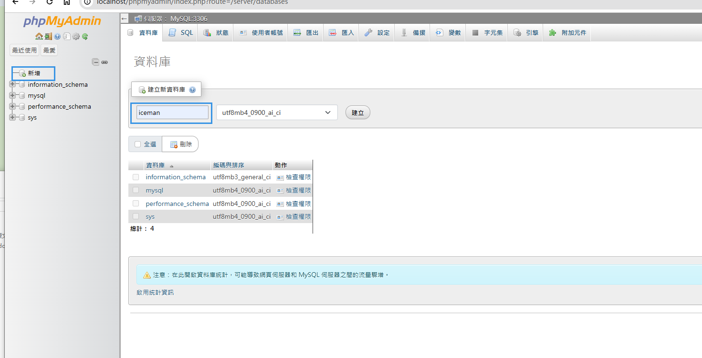
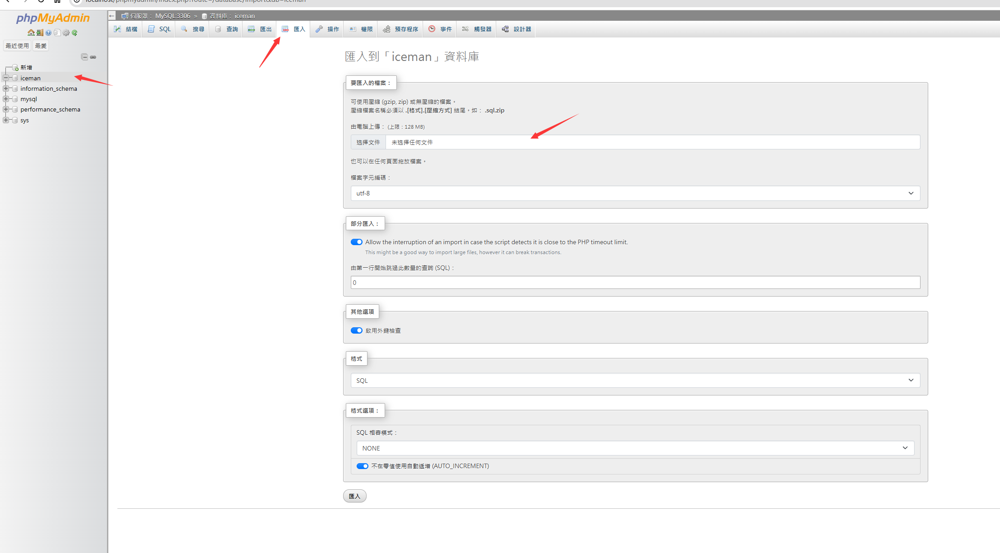
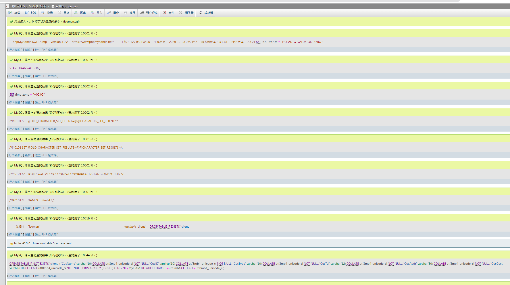
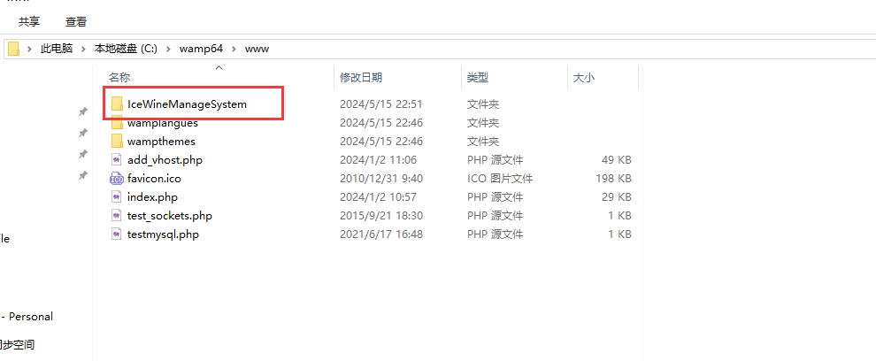
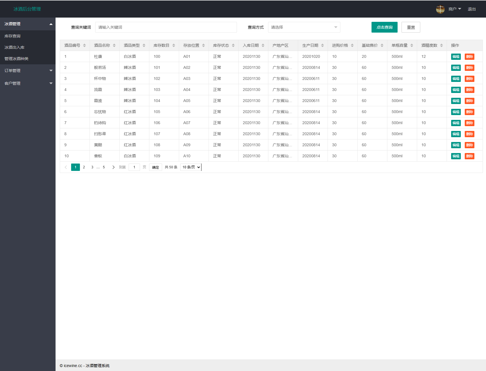

# Windows 环境配置指引

0. 配置和运行 WampServer 集成环境、Python 环境（请自行搜索安装）；
   - 本文使用版本 WampServer 3.3.5，PHP 8.2.18，MYSQL 8.3.0，Python 3.10

1. 打开 phpmyadmin （默认用户名 root，无密码）

   http://localhost/phpmyadmin/

2. 新建数据库 'iceman'

   

3. 导入 SQL 文件，选择项目目录 ‘database/iceman.sql’，点击导入

4. WampServer 设置显示 www 文件夹，右键 Wamp 图标 -> Wamp Settings -> Show www folder in menu
5. 复制项目文件到 www 文件夹

6. 访问项目地址 http://localhost/IceWineManageSystem/demo/login-page.html

​	用户名和密码都是 ‘root’

7. 点击‘登录’，进入冰酒管理页面

